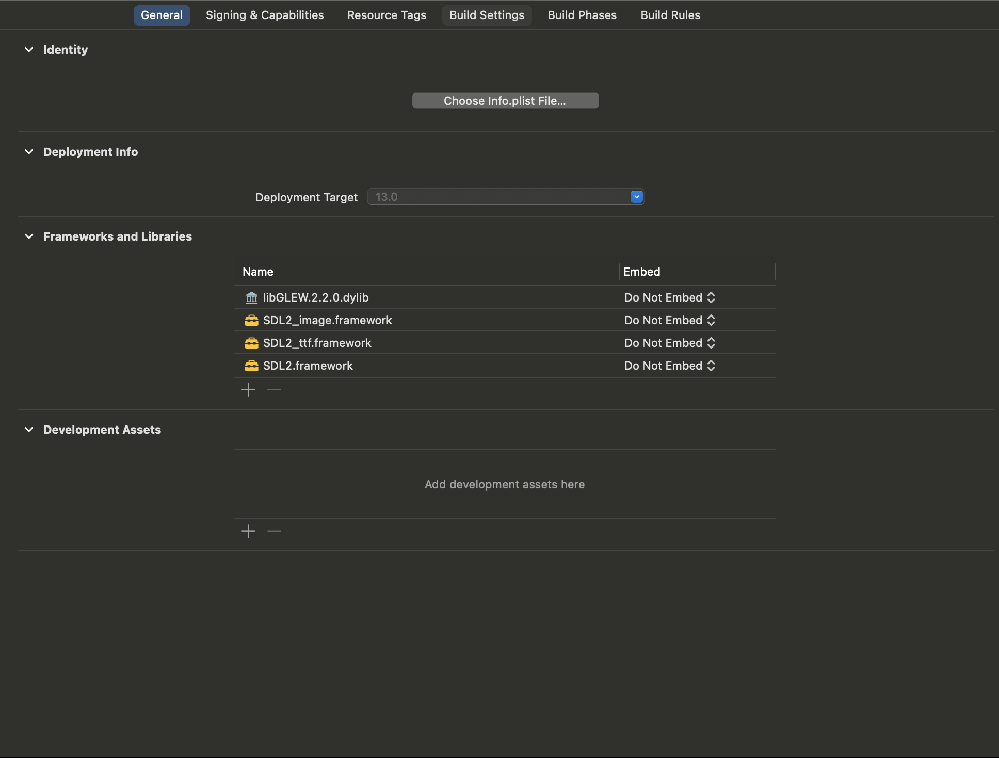
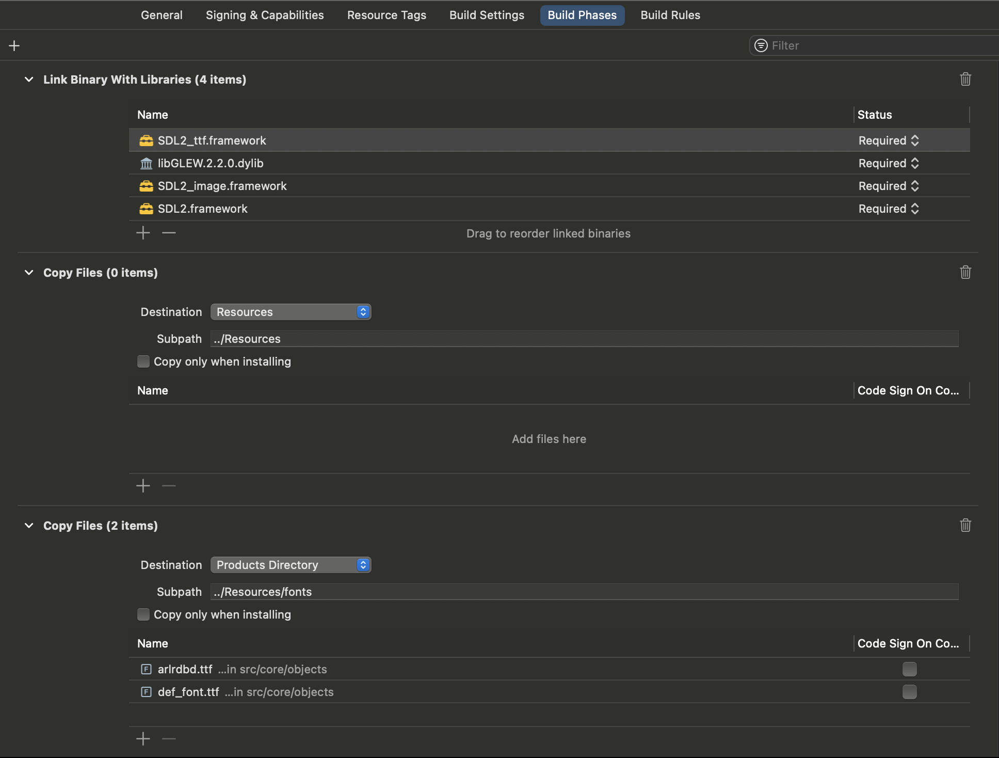

# Incogine
A proprietary engine, mostly used for games by leafstudiosDot.
## Building
- CMake
    - XCode
    - Visual Studio 2022

In CMake, it will generate a project for you to build in time quickly.

### macOS
In macOS, We use XCode for developing Incogine.

After you use CMake to generate an XCode project, Do all the following in Project Target Properties:

## Bundling application
### macOS
#### Method 1
- Xcode for bundling an application.
### Windows
- Visual Studio 2022 for bundling an application. (Still working on it)
### Linux
- Editing soon
## License
Learn more in `LICENSE.md` for more information about the permission for this code.
